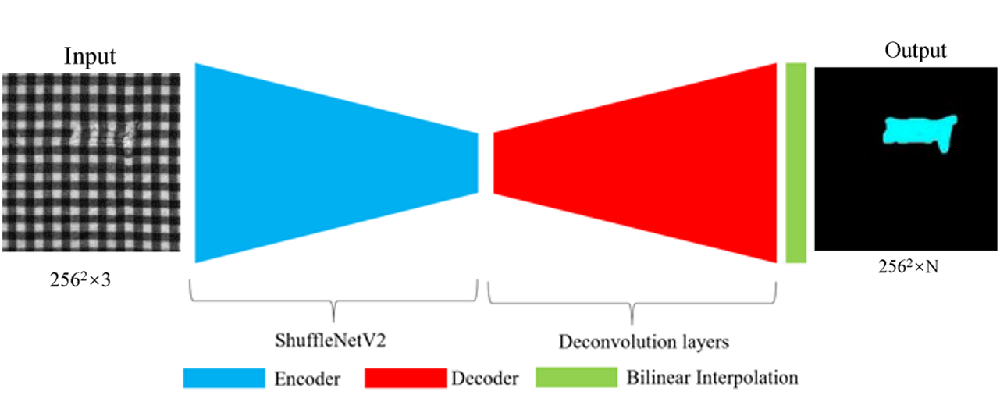
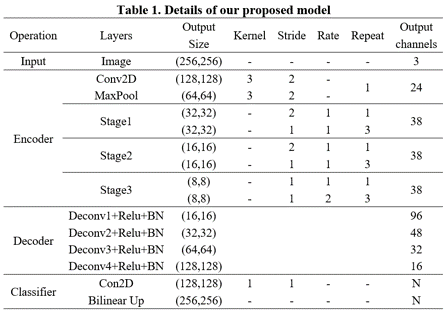
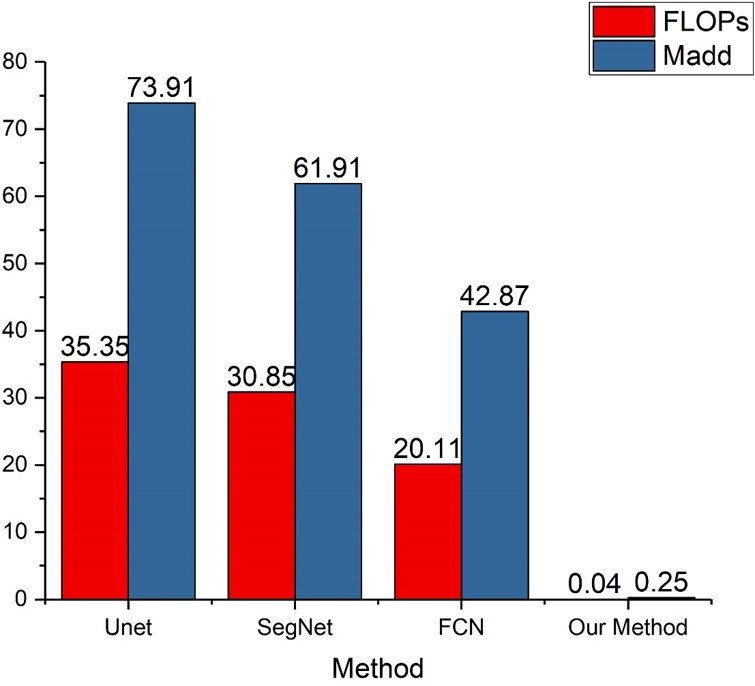
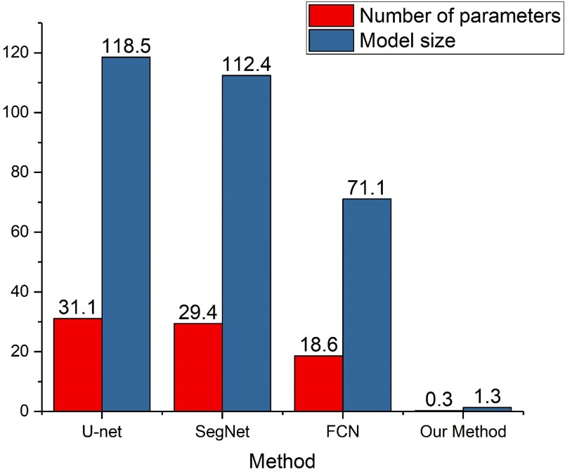
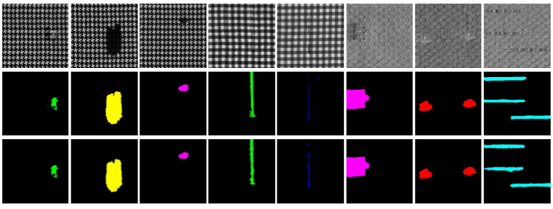

# FabricDefectDetection
AIFT2019-Real-time fabric defect segmentation based on convolutional neural network
## Prerequisites
Ubuntu 16.04 
Python 3.5 
Pytorch 1.0 
Cuda 9.0 
## Model structure 

## Details of our proposed model

## Label tool
标注精灵[http://www.jinglingbiaozhu.com/](http://www.jinglingbiaozhu.com/). 

## FLOPs and Madd

## Model size

## Detection results

